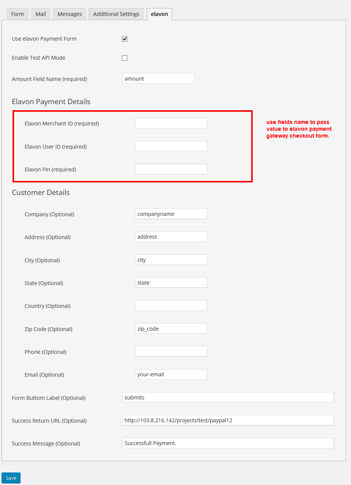
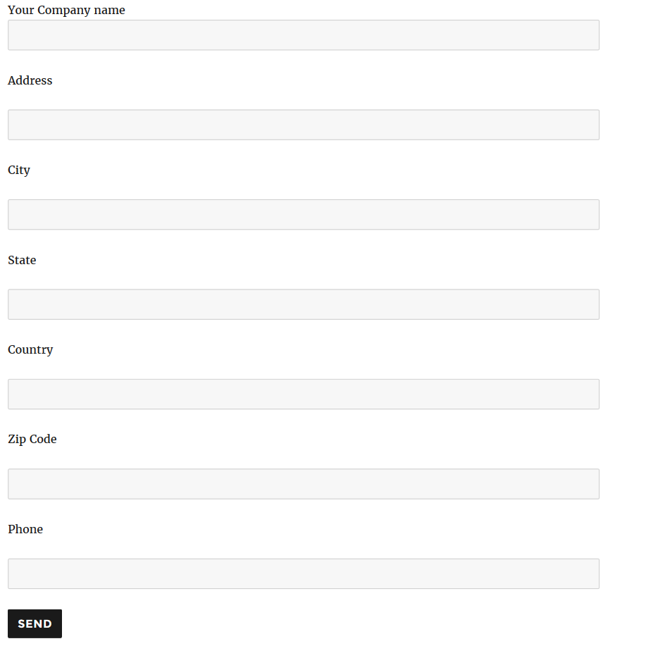
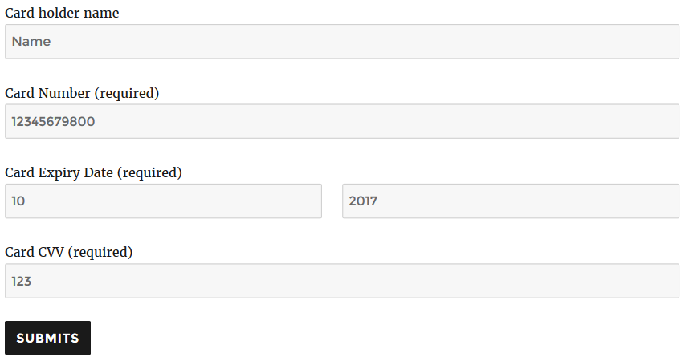

# contact-form-7-elavon-converge
The Elavon payment gateway can be successfully integrated with Contact Form 7. With the assistance of Contact Form 7 – Elavon Converge, you can receive credit card payments directly from your customers, thus preventing them from landing upon a third party payment page and increasing customer satisfaction. The Elavon Payment Gateway is an affordable solution that can be used by small and medium-sized businesses for quick and secure transactions. Elavon provides smart &amp; simple to use and easy to integrate features to accept your website’s online payments.

# Installation
1. Download the plugin zip file from WordPress.org plugin site to your desktop / PC
2. If the file is downloaded as a zip archive, extract the plugin folder to your desktop.
3. With your FTP program, upload the plugin folder to the wp-content/plugins folder in your WordPress directory online
4. Go to the Plugin screen and find the newly uploaded Plugin in the list.
5. Click ‘Activate Plugin’ to activate it.

# How To Use

You have to configure it from wp-admin > Contact > Add/Edit Contact Forms (Contact Form 7 needs to be activated before) to use this plugin.

You will find a new tab, “Elavon,” along with Form, Mail, Messages, and Additional Settings, where you can make all settings related to Elavon Converge.

To add the Elavon payment form to your Contact Form 7, you will find below-given setting attributes

Shows front end view for first screen of this plugin.

shows front end view for second screen of this plugin.

- **Use Elavon Payment Form**
 This option will allow you to attach the Elavon payment form with particular Contact Form 7. If this option is selected, the Elavon payment form will be displayed otherwise, Contact Form 7 will work as it is.

- **Enable Test API Mode**
 This option will allow you to set the Elavon payment process in test mode.
 
- **Amount Field Name (required)**
 Enter the name of the field from where the amount of value needs to be retrieved.
 
- **Elavon Merchant ID (required)**
 Enter the name of the field from where the merchant id value needs to be retrieved.
 
- **Elavon User ID (required)**
 Enter the name of the field from where the user-id value needs to be retrieved.
 
- **Elavon Pin(required)**
 Enter the name of the field from where the pin value needs to be retrieved.

- **Description (Optional)**
 Enter the name of the field from where the description value needs to be retrieved.

- **Salestax (Optional)**
 Enter the name of the field from where the Salestax value needs to be retrieved.

- **Company Name (Optional)**
 Enter the name of the field from where company value needs to be retrieved.
 
 - **Address (Optional)**
 Enter the name of the field from where the address value needs to be retrieved.

 - **City (Optional)**
 Enter the name of the field from where the city value needs to be retrieved.
 
 - **State (Optional)**
 Enter the name of the field from where the state value needs to be retrieved.

 - **Country (Optional)**
 Enter the name of the field from where the country value needs to be retrieved.
 
 - **Zip Code (Optional)**
 Enter the name of the field from where the zip code value needs to be retrieved.
 
- **Phone (Optional)**
 Enter the name of the field from where the phone value needs to be retrieved.

- **Email (Optional)**
 Enter the name of the field from where the email value needs to be retrieved.
 
 - **Form Button Label (Optional)**
 Enter Label for the Elavon Payment Form Submit button.

 - **Success Return URL (Optional)**
 Enter any URL to return after making a successful Elavon payment.

 - **Success Message (Optional)**
 Enter any text message to display after form submission and completing successful payment.

# Getting Help

If you have any difficulties while using this Plugin, please feel free to contact us at opensource@zealousweb.com. We also offer custom WordPress extension development and WordPress theme design services to fulfill your e-commerce objectives. Our professional dy‐ namic WordPress experts provide profound and customer-oriented development of your project within short timeframes. Thank you for choosing a Plugin developed by ZealousWeb!
